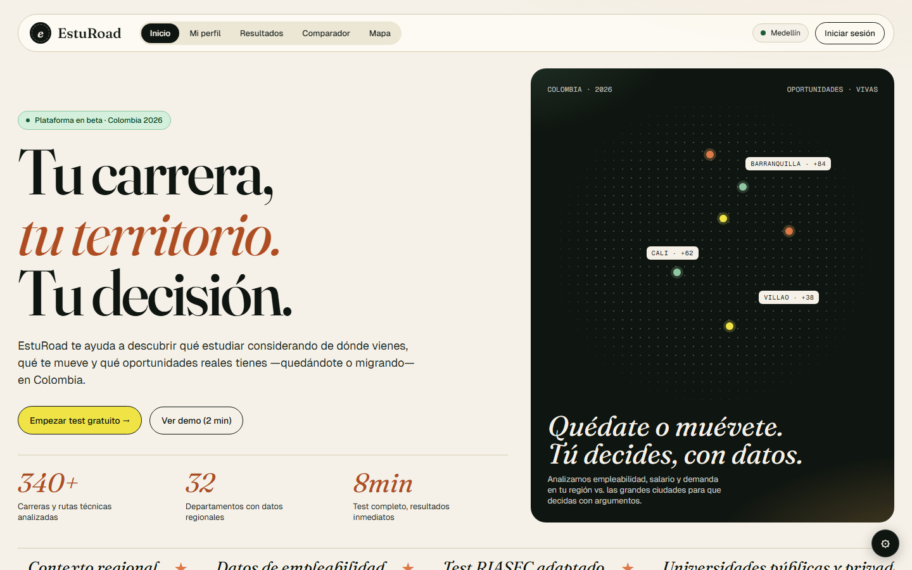
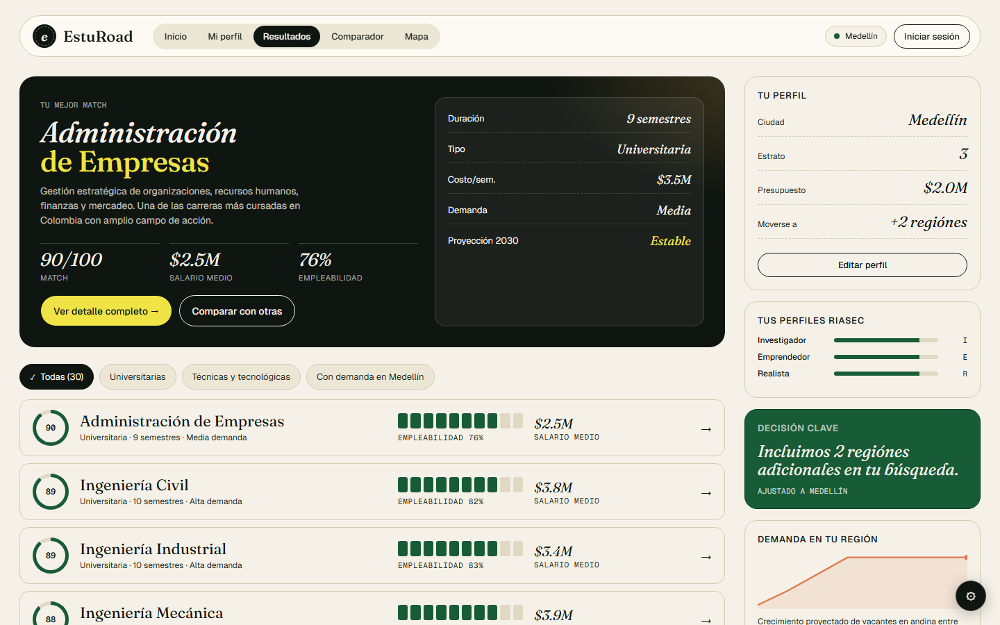
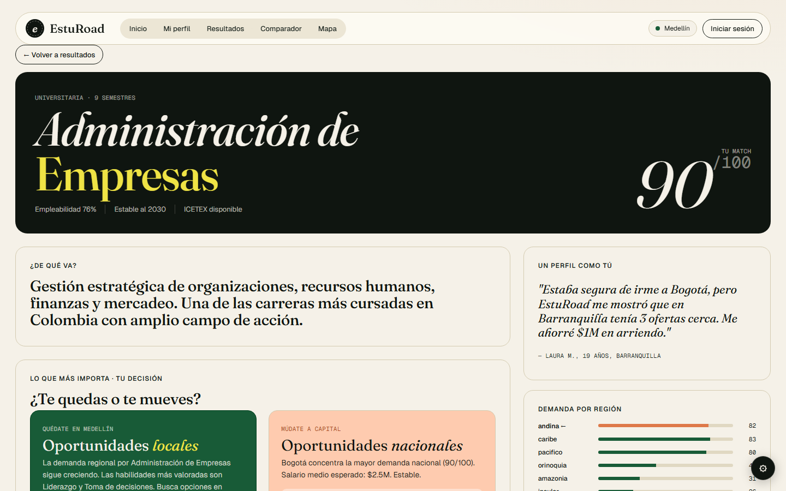
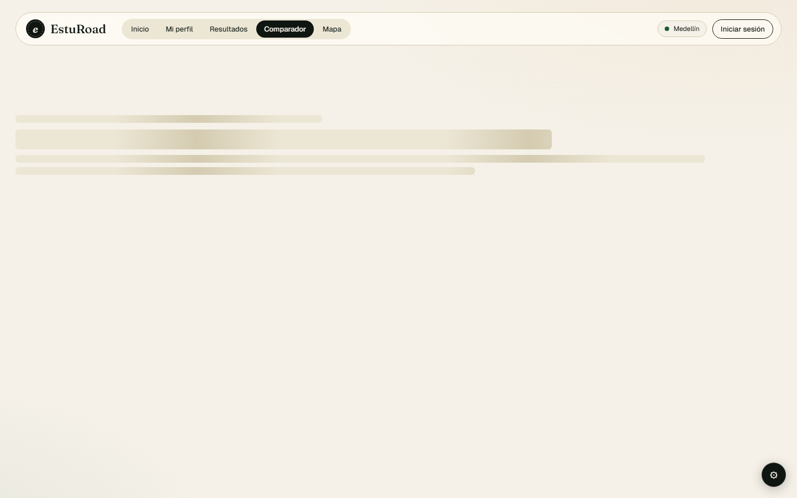

# EstuRoad

**Plataforma de orientación vocacional para estudiantes colombianos de bachillerato.**

EstuRoad ayuda a estudiantes a descubrir qué estudiar considerando su contexto real: de dónde vienen, cuánto pueden gastar, si quieren o pueden mudarse, y qué habilidades tienen. No es solo un test de personalidad — es una recomendación basada en empleabilidad regional, costo real y proyección 2030.

> **Live demo:** [esturoad.vercel.app](https://esturoad.vercel.app)

---

## Screenshots

<p align="center">
  
  
</p>
<p align="center">
  
  
</p>

---

## Tech stack

| Layer | Technology |
|-------|-----------|
| Frontend | React 19 + TypeScript 6 + Vite 8 |
| Routing | React Router 7 |
| Styles | CSS custom properties (zero UI libraries) |
| Data API | EduRoad API (custom-built, Express + MongoDB, Vercel) |
| Profiles API | Express 4 + MongoDB 7 + Mongoose 8 |
| Auth | httpOnly session cookie (HMAC) |
| Validation | Joi (server) |
| Tests | Vitest 4 (unit) + Playwright 1.59 (E2E) |
| CI | GitHub Actions |
| Deploy | Vercel (frontend + APIs) |
| Fonts | Fraunces (display) + Geist (UI) + Geist Mono |

---

## EduRoad API

The career data is served by a separate REST API also built by the same author — **[eduroad-api.vercel.app](https://eduroad-api.vercel.app/api/docs)**.

> **API Docs (Swagger UI):** [eduroad-api.vercel.app/api/docs](https://eduroad-api.vercel.app/api/docs)

### Endpoints

| Method | Path | Description |
|--------|------|-------------|
| `GET` | `/api/carreras` | Paginated list of careers (`?limit=` `&page=`) |
| `GET` | `/api/carreras/:slug` | Single career by slug |

### Career object (23 fields)

```json
{
  "nombre": "Ingeniería Civil",
  "slug": "ingenieria-civil",
  "tipo": "universitaria",
  "categoria": "Ingeniería",
  "duracionSemestres": 10,
  "costoSemestre": 4200000,
  "salarioEntrada": 2200000,
  "salarioMedio": 3800000,
  "salarioMediana": 3500000,
  "empleabilidad": 82.0,
  "tasaEmpleabilidad12m": 78.0,
  "proyeccion2030": "Alta. Infraestructura vial...",
  "acreditadaAltaCalidad": true,
  "demandaPorRegion": { "Bogotá": 88, "Antioquia": 82, "... " : "..." },
  "universidades": ["Universidad Nacional", "..."],
  "habilidadesRequeridas": ["Matemáticas", "..."],
  "tags": ["infraestructura", "..."],
  "cineCode": "0732",
  "ultimaActualizacion": "2026-04-21T00:00:00"
}
```

Data sourced from **SNIES** (Sistema Nacional de Información de la Educación Superior) and **OLE** (Observatorio Laboral para la Educación) — Colombia's official higher education and labor market registries. 300+ careers, updated 2026.

---

## Data flow

```
Student fills 8-step onboarding
         │
         ▼
   AppContext (profile)
         │
         ▼
useCarreras(profile) → GET /api/carreras
         │
         ▼
scoreCarrera(carrera, profile)   ← multi-criteria algorithm
  ├─ RIASEC match (+12 max)
  ├─ Interests match (+8 max)
  ├─ Skills match (+6 max)
  ├─ Materias → RIASEC cross-signal (+6 max)
  ├─ Regional demand (stays or moves, +10 max)
  ├─ Budget fit (−15 penalty if unaffordable)
  ├─ Work-study compatibility (+8 SENA bonus)
  ├─ High-achiever bonus (promedio ≥ 4.5)
  ├─ Accreditation bonus (+4)
  └─ Clamped to [35, 98]
         │
         ▼
Ranked list → Results / Detail / Compare / Map
```

---

## Scoring algorithm

The matching engine in `src/utils/scoring.ts` combines eight weighted signals:

| Signal | Max points | Logic |
|--------|-----------|-------|
| RIASEC overlap | +12 | Intersection of student codes × career codes |
| Interest overlap | +8 | Student interests vs. career interests |
| Skills overlap | +6 | Student habilidades vs. career habilidadesRequeridas |
| Materias cross-signal | +6 | School subjects → RIASEC categories → career codes |
| Regional demand | +10 | `demandaPorRegion[regionId]` scaled; expands if `regionesDisponibles` set |
| Budget fit | −15 penalty | `costoSemestre > presupuesto × 4` |
| Work-study fit | +8 | SENA/Tecnológica careers score higher when student needs to work |
| High achiever | +4 | `promedio ≥ 4.5` AND `empleabilidad ≥ 85` |
| Accreditation | +4 | `acreditadaAltaCalidad === true` |

Final score is clamped to `[35, 98]`.

---

## Security

Six OWASP Top 10 categories mitigated:

| # | Category | Mitigation |
|---|---------|-----------|
| A01 | Broken Access Control | `PATCH /perfiles/:id` requires session cookie matching the `:id` via HMAC |
| A02 | Cryptographic Failures | Session token in `HttpOnly; Secure; SameSite=Strict` cookie — never in JS |
| A03 | Injection | Joi schema validation on all write endpoints (`createPerfilSchema`, `updatePerfilSchema`) |
| A05 | Security Misconfiguration | Explicit Helmet CSP (`defaultSrc 'self'`, font/connect allowlist), HSTS |
| A07 | Auth Failures | `credentials: 'include'` on all API calls; cookie auto-sent by browser |
| A09 | Logging Failures | Structured audit log on every profile create/update (`{ timestamp, action, perfilId, ip }`) |

---

## Getting started

### Prerequisites

- Node.js 20+
- pnpm 9+
- MongoDB 7 (local or Atlas)

### Frontend

```bash
# Clone and install
git clone https://github.com/Miguel-Bayter/esturoad.git
cd esturoad
pnpm install

# Start dev server
pnpm dev
# → http://localhost:5173
```

### Backend (optional for full functionality)

```bash
cd server
npm install

# Configure environment
cp .env.example .env
# Fill in MONGODB_URI and SESSION_SECRET

# Seed the database
npm run seed

# Start API server
npm run dev
# → http://localhost:3001
```

The frontend works in demo mode without a backend. Click **"Ver demo (2 min)"** on the landing page.

---

## Running tests

```bash
# Unit tests (Vitest) — 31 tests
pnpm test

# E2E tests (Playwright, Chromium) — 25 tests
pnpm e2e

# Interactive E2E UI
pnpm e2e:ui

# Format check (CI)
pnpm format:check
```

### Test coverage

| Suite | Tests | What it covers |
|-------|-------|---------------|
| `scoring.test.ts` | 9 | Scoring algorithm edge cases |
| `adapters.test.ts` | 13 | API response normalization |
| `format.test.ts` | 9 | Currency formatting, toggle utility |
| `onboarding.spec.ts` | 4 | 8-step flow, back/forward navigation |
| `navigation.spec.ts` | 7 | URL routing, detail, 404, filters |
| `accessibility.spec.ts` | 7 | Skip link, ARIA, keyboard nav, SVG map |
| `security.spec.ts` | 5 | localStorage, sessionToken, backend validation |

---

## Design decisions

### 1. CSS custom properties over Tailwind

Zero UI library dependencies. A `--paper` / `--green` / `--lime` token system with a single `index.css` source of truth. This makes the design system auditable and avoids the specificity cascade issues that come with utility-first CSS in component-heavy apps.

### 2. publicId + httpOnly cookie over JWT in localStorage

Students may not have an email address. A short `publicId` (e.g. `col-bog-a3f2`) lets them recover their session without registration. The session token lives in an `HttpOnly` cookie — never reachable from JavaScript — which directly addresses OWASP A02.

### 3. URL-based routing over state machine

Replaced `setScreen()` state with React Router 7. Every screen has a shareable URL, the browser back button works correctly, and deep links to `/detalle/:slug` work without prior navigation.

### 4. Module-level cache in useCarreras

`carrerasCache` is a module-level variable, not React state. This means navigating between Results → Detail → Compare doesn't trigger re-fetches. Stale cache (`staleCache`) is served on network failure with a warning banner.

### 5. Multi-criteria scoring without ML

The scoring function is deterministic, auditable, and testable. Weights were calibrated against SNIES/OLE employment data. The `[35, 98]` clamp prevents extreme scores that would mislead students.

---

## Project structure

```
esturoad/
├── src/
│   ├── api/           # HTTP client + data adapters
│   ├── components/
│   │   ├── layout/    # Nav, TweaksPanel
│   │   ├── screens/   # Landing, Onboarding, Results, Detail, Compare, Map
│   │   └── ui/        # Chip, Skeleton, ColombiaMap, EmptyState, Spark
│   ├── context/       # AppContext (profile, auth, favorites, isDemo)
│   ├── data/          # constants, demoProfile
│   ├── hooks/         # useCarreras (fetch + rank + cache)
│   ├── styles/        # index.css (single source of truth)
│   ├── types/         # TypeScript types
│   └── utils/         # scoring.ts, format.ts
├── server/
│   ├── src/
│   │   ├── controllers/
│   │   ├── middleware/  # authenticate, validate, errorHandler
│   │   ├── models/
│   │   ├── routes/
│   │   ├── utils/       # auditLog
│   │   └── validators/  # Joi schemas
│   └── README.md
├── tests/e2e/         # Playwright E2E specs
├── src/__tests__/     # Vitest unit tests
└── .github/workflows/ # CI: lint, format, test, build
```

---

## Roadmap

- [ ] Firebase / Supabase auth for cross-device session persistence
- [ ] University database with real program costs (via SNIES API)
- [ ] Personalised weekly email digest with new career data
- [ ] Mobile app (React Native, shared scoring logic)
- [ ] Institution dashboard for schools to see aggregate student trends

---

## License

MIT © 2026 Miguel Bayter
